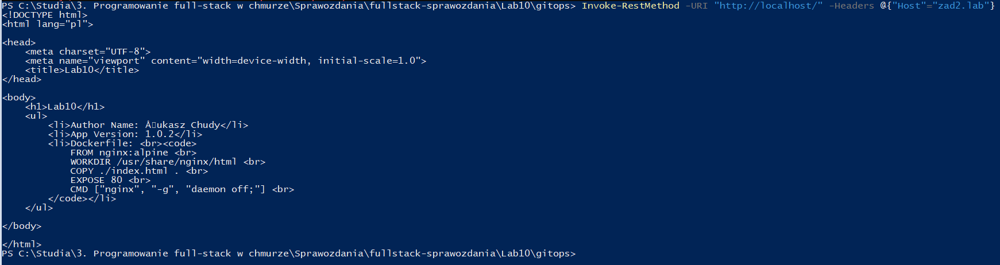

# Repozytoria:

- https://github.com/Ornez/fullstack-lab10-source
- https://github.com/Ornez/fullstack-lab10-config
- https://hub.docker.com/u/student232323
# Zadanie 1A

### fullstack-lab10-source/index.html

```
<!DOCTYPE html>
<html lang="pl">

<head>
    <meta charset="UTF-8">
    <meta name="viewport" content="width=device-width, initial-scale=1.0">
    <title>Lab10</title>
</head>

<body>
    <h1>Lab10</h1>
    <ul>
        <li>Author Name: Łukasz Chudy</li>
        <li>App Version: 1.0.3</li>
        <li>Dockerfile: <br><code>
            FROM nginx:alpine <br>
            WORKDIR /usr/share/nginx/html <br>
            COPY ./index.html . <br>
            EXPOSE 80 <br>
            CMD ["nginx", "-g", "daemon off;"] <br>
        </code></li>
    </ul>

</body>

</html>
```

### fullstack-lab10-source/dockerfile

```
FROM nginx:alpine 
WORKDIR /usr/share/nginx/html
COPY ./index.html .
EXPOSE 80
CMD ["nginx", "-g", "daemon off;"]
```

# Zadanie 1B

### fullstack-lab10-config/lab10-deployment.yaml

```
apiVersion: apps/v1
kind: Deployment
metadata:
  name: lab10-deployment
spec:
  replicas: 4
  selector:
    matchLabels:
      app: lab10-app
  strategy:
    type: RollingUpdate
    rollingUpdate:
      maxSurge: 5
      maxUnavailable: 2
  template:
    metadata:
      labels:
        app: lab10-app
    spec:
      containers:
        - name: lab10-app
          image: student232323/lab10-app:1.0.3
```

### fullstack-lab10-config/lab10-service.yaml

```
apiVersion: v1
kind: Service
metadata:
  name: lab10-service
spec:
  type: NodePort
  ports:
    - port: 8080
      targetPort: 80
      nodePort: 30007
  selector:
    app: lab10-app
```

### fullstack-lab10-config/lab10-ingress.yaml

```
apiVersion: networking.k8s.io/v1
kind: Ingress
metadata:
  name: lab10-ingress
spec:
  rules:
  - host: zad2.lab
    http:
      paths:
      - pathType: Prefix
        path: "/"
        backend:
          service:
            name: lab10-service
            port:
              number: 8080
```

# Zadanie 2A i 2B

### fullstack-lab10-source/.github/workflows/zad2lab10.yml

```
name: Docker CI

on:
  workflow_dispatch:
  push:
    branches: [ "main" ]
  pull_request:
    branches: [ "main" ]

jobs:
  dockerCI:
    runs-on: ubuntu-latest
    outputs:
      version_number: ${{ steps.vars.outputs.version_number }}

    steps:
    - name: Check out the repo
      uses: actions/checkout@v4
    
    - name: Set up QEMU
      uses: docker/setup-qemu-action@v3
      
    - name: Set up Docker Buildx
      uses: docker/setup-buildx-action@v3

    - name: set-output
      id: vars
      run: |
        version_number=$(sed -n 's/.*App Version: \(.*\)<\/li>/\1/p' index.html)
        echo "version_number=${version_number}" >> "$GITHUB_OUTPUT"
      shell: bash
      
    - name: Login to Docker Hub
      uses: docker/login-action@v3
      with:
        username: ${{ secrets.DOCKER_HUB_LOGIN }}
        password: ${{ secrets.DOCKER_HUB_PASSWORD }}
        
    - name: Build and push
      uses: docker/build-push-action@v5
      with:
        context: .
        platforms: linux/amd64,linux/arm64
        push: true
        tags: student232323/lab10-app:${{ steps.vars.outputs.version_number}}

  kubernetesCI:
    needs: dockerCI
    runs-on: ubuntu-latest

    steps:
      - name: Check out the repo
        uses: actions/checkout@v4
        with:
          repository: Ornez/fullstack-lab10-config
          token: ${{ secrets.ACTIONS_TOKEN }}
      - run: |
          sed -i 's/student232323\/lab10-app:.*/student232323\/lab10-app:${{ needs.dockerCI.outputs.version_number }}/g' lab10-deployment.yaml
          git config user.name github-actions
          git config user.email github-actions@github.com
          git add -u
          git commit -m "updated app version ${{ needs.dockerCI.outputs.version_number }}"
          git push
```

# Zadanie 3A i 3B

- https://hub.docker.com/search?q=student232323

### fullstack-sprawozdania/Lab10/gitops/dockerfile

```
FROM alpine:latest

RUN apk update && \
    apk add --no-cache git curl && \
    apk add --no-cache --repository=http://dl-cdn.alpinelinux.org/alpine/edge/community kubectl

CMD ["/bin/sh"]
```

### fullstack-sprawozdania/Lab10/gitops/operator-stepcd.yaml

```
apiVersion: batch/v1
kind: CronJob
metadata:
  name: stepcd
spec:
  schedule: "*/2 * * * *"
  concurrencyPolicy: Forbid
  jobTemplate:
    spec:
      backoffLimit: 0
      template:
        spec:
          restartPolicy: Never
          serviceAccountName: gitops
          containers:
            - name: zad2gitops 
              image: student232323/lab10-stepcd
              command: [sh, -e, -c]
              args:
                - git clone https://github.com/Ornez/fullstack-lab10-config.git /tmp/lab10_config && find /tmp/lab10_config -name '*.yaml' -exec kubectl apply -f {} \;
```

# Zadanie 4A

### Polecenia:

```
docker build -t student232323/lab10-stepcd .
docker login
docker push student232323/lab10-stepcd:latest
```

```
kubectl apply -f .\operator-stepcd.yaml
kubectl get all
```

```
minikube tunnel
Invoke-RestMethod -URI "http://localhost/" -Headers @{"Host"="zad2.lab"}
```




# Zadanie 4B

Zmiana wersji z 1.0.2 na 1.0.3


Jak widać wersja aplikacji została zmieniona.


