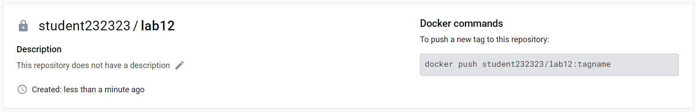
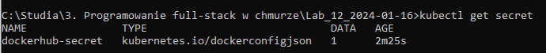
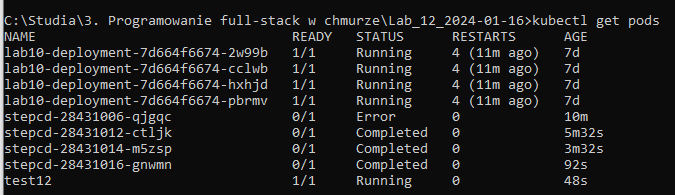
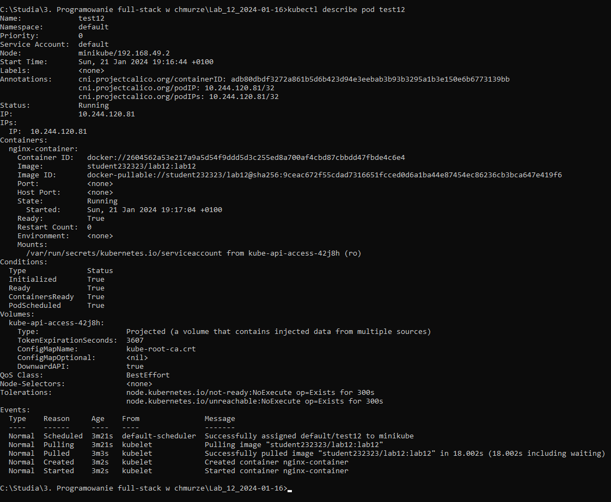

## Lab 12 - Zadanie

## SecurityContext - przypomnienie. Zasady konfiguracji zasad dostępu do zasobów API. Obiekty ServiceAccount, Role oraz RoleBinding. Zasięg tworzonych zasad.

## Łukasz Chudy 92844

### Dockerfile i prywatne repo

```dockerfile
FROM nginx:latest
```

Utworzenie prywatnego repozytorium na docker-hub



```bash
docker login
docker build -t student232323/lab12:lab12 .
docker push student232323/lab12:lab12
```

### Plik yaml

```
apiVersion: v1
kind: Pod
metadata:
  name: test12
spec:
  containers:
  - name: nginx-container
    image: student232323/lab12:lab12
  imagePullSecrets:
  - name: dockerhub-secret
```

### Tworzenie secret

```bash
kubectl create secret docker-registry dockerhub-secret --docker-server=https://index.docker.io/v1/ --docker-username=student232323 --docker-password=DOCKERHUB_PASSWORD
```

```
kubectl get secret
```



```
kubectl apply -f test12.yaml
kubectl get pods
kubectl describe pod test12
```




