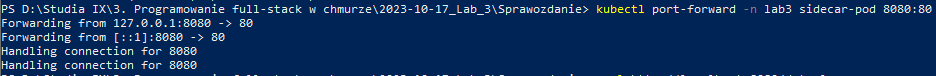

## Lab 3 - Zadanie

## Łukasz Chudy 92844

### plik.yaml
```
apiVersion: v1
kind: Pod
metadata:
  name: sidecar-pod
  namespace: lab3
spec:
  containers:
  - name: busybox-container
    image: busybox
    command: ["/bin/sh", "-c", "while true; do date >> /var/log/date.log; sleep 5; done"]
    volumeMounts:
    - name: shared-volume
      mountPath: /var/log

  - name: nginx-container
    image: nginx
    volumeMounts:
    - name: shared-volume
      mountPath: /usr/share/nginx/html

  volumes:
  - name: shared-volume
    hostPath:
      path: /shared-folder
```

## Polecenia:
```
minikube start
cd "D:\Studia IX\3. Programowanie full-stack w chmurze\2023-10-17_Lab_3\Sprawozdanie"

kubectl create namespace lab3
kubectl create -f plik.yaml
```

```
kubectl get pods --all-namespaces -o wide
```

Tutaj trochę eksperymentowałem, nie określiłem w port-forward namespace i mi błędy wyskakiwały.
Możliwe że to polecenie nie jest potrzebne.

```
kubectl apply -f plik.yaml
```

```
kubectl port-forward -n lab3 sidecar-pod 8080:80
```




