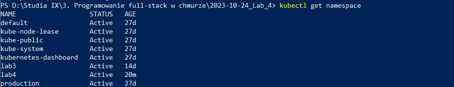
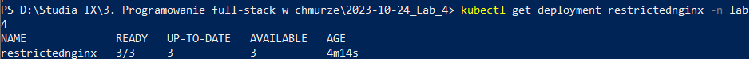
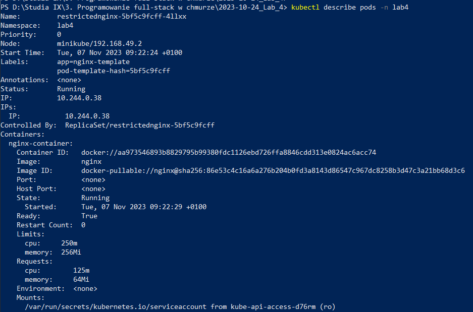
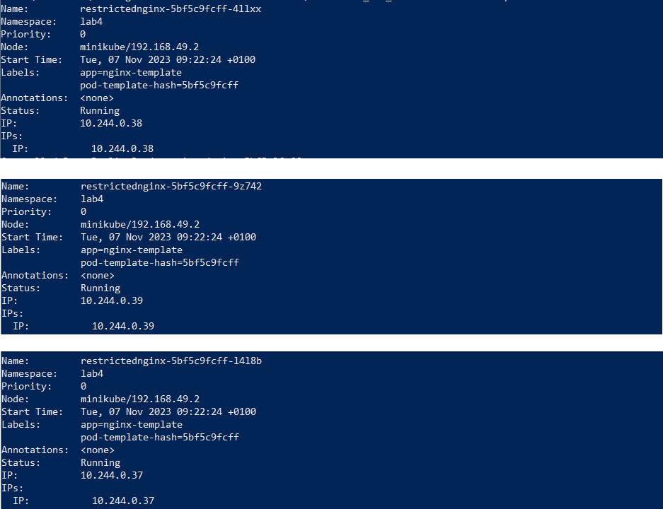

## Lab 4 - Zadanie

## Łukasz Chudy 92844

### Tworzenie namespace lab4

`kubectl create namespace lab4`

### lab4-namespace.yaml

```
apiVersion: v1
kind: ResourceQuota
metadata:
  name: lab4-quota
spec:
  hard:
    pods: "5"
    limits.cpu: "1000m"
    limits.memory: "1Gi"
```

`kubectl apply -n lab4 -f lab4-namespace.yaml`

### Deployment

restrictednginx.yaml

```
apiVersion: apps/v1
kind: Deployment
metadata:
  name: restrictednginx
  namespace: lab4
spec:
  replicas: 3
  selector:
    matchLabels:
      app: nginx-template
  template:
    metadata:
      labels:
        app: nginx-template
    spec:
      containers:
      - name: nginx-container
        image: nginx
        resources:
          limits:
            memory: "256Mi"
            cpu: "250m"
          requests:
            memory: "64Mi"
            cpu: "125m"
```

`kubectl apply -f restrictednginx.yaml`

### Sprawdzenie poprawności

Sprawdzenie przestrzeni nazw lab4

`kubectl get namespace`



Sprawdzenie deployment w przestrzeni nazw lab4

`kubectl get deployment restrictednginx -n lab4`



Szczegóły podów w przestrzeni nazw lab4.

`kubectl describe pods -n lab4`



Polecenie pokazuje 3 utworzone pody.


