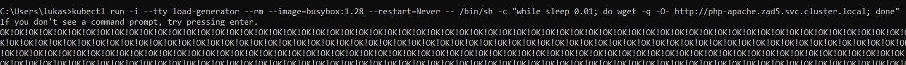
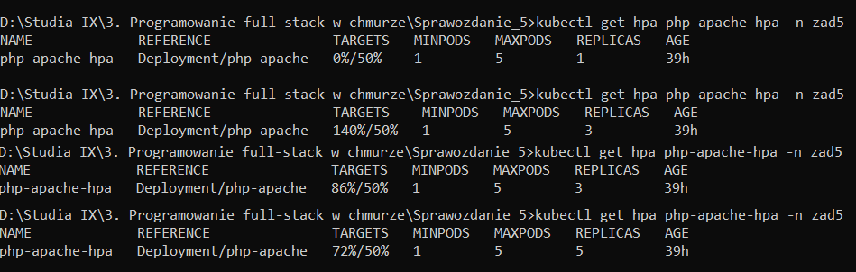
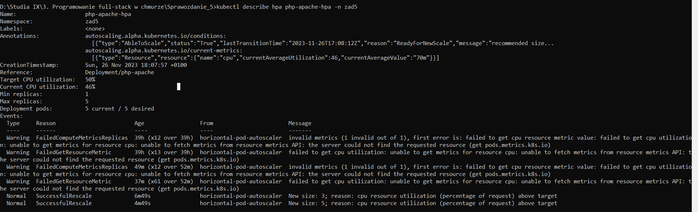
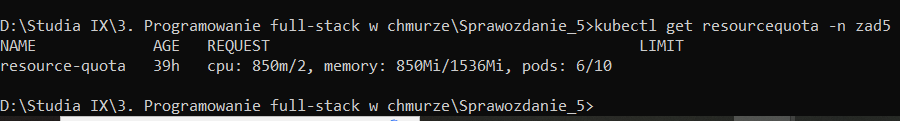
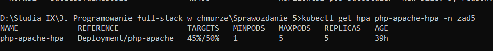

## Lab 5 - Zadanie

## Łukasz Chudy 92844

### lab5-quota.yaml

```
apiVersion: v1
kind: ResourceQuota
metadata:
  name: resource-quota
  namespace: zad5
spec:
  hard:
    pods: "10"
    cpu: 2000m
    memory: 1.5Gi
```

### lab5-worker-pod.yaml

```
apiVersion: v1
kind: Pod
metadata:
  name: worker
  namespace: zad5
spec:
  containers:
  - name: nginx-container
    image: nginx
    resources:
      limits:
        memory: "200Mi"
        cpu: "200m"
      requests:
        memory: "100Mi"
        cpu: "100m"
```

### lab5-php-apache.yaml

```
apiVersion: apps/v1
kind: Deployment
metadata:
  name: php-apache
  namespace: zad5
spec:
  selector:
    matchLabels:
      run: php-apache
  template:
    metadata:
      labels:
        run: php-apache
    spec:
      containers:
        - name: php-apache
          image: registry.k8s.io/hpa-example
          ports:
            - containerPort: 80
          resources:
            limits:
              memory: 250Mi
              cpu: 250m
            requests:
              memory: 150Mi
              cpu: 150m
---
apiVersion: v1
kind: Service
metadata:
  name: php-apache
  namespace: zad5
  labels:
    run: php-apache
spec:
  ports:
    - port: 80
  selector:
    run: php-apache
```

### zad5-HorizontalPodAutoscaler.yaml

Aby autoskaler działał poprawnie, musi mieć dostęp do metryk. Serwer metryk włączamy komendą:

```
minikube addons enable metrics-server
```

```
apiVersion: autoscaling/v1
kind: HorizontalPodAutoscaler
metadata:
  name: php-apache-hpa
  namespace: zad5
spec:
  scaleTargetRef:
    apiVersion: apps/v1
    kind: Deployment
    name: php-apache
  minReplicas: 1
  maxReplicas: 5
  targetCPUUtilizationPercentage: 50
```

Maksymalna liczba replik wynika z ograniczeń nadanych przez ResourceQuota. Umożliwia ona utworzenie 10 pod'ów, użycie CPU w ilości 2000m oraz pamięci w ilości 1.5Gi. 

Działa również pod worker, który jest ograniczony do maksymalnie 200m CPU i 200Mi pamięci.

Po uwzględnieniu poda worker, dostępne zostaje 1800m CPU, 1.3Gi pamięci oraz 9 podów.

**1800m / 250m = 7,2**
**1.3Gi / 250 = 5,2**

Po przeanalizowaniu dostępnych zasobów i porównianiu ich z maksymalnymi używanymi przez pody, racjonalnym wyborem jest ustawienie autoscaler'a na maksymalnie 5 pod'ów.

### Utworzenie obiektów

```
kubectl apply -f lab5-quota.yaml
```

```
kubectl apply -f zad5-worker-pod.yaml
```

```
kubectl apply -f lab5-php-apache.yaml
```

```
kubectl apply -f zad5-HorizontalPodAutoscaler.yaml
```

### Polecenia do weryfikacji

```
kubectl run -i --tty load-generator --rm --image=busybox:1.28 --restart=Never -- /bin/sh -c "while sleep 0.01; do wget -q -O- http://php-apache.zad5.svc.cluster.local; done"
```



```
kubectl get hpa php-apache-hpa -n zad5
```



```
kubectl describe hpa php-apache-hpa -n zad5
```



```
kubectl get resourcequota -n zad5
```





Ostateczny target 45%.

Używane CPU: 850m/2000m
Używana pamięć: 850Mi/1536Mi
Używane pody 6/10
Autoskaler utworzył 5 replik

**resource-quota   39h   cpu: 850m/2, memory: 850Mi/1536Mi, pods: 6/10**

