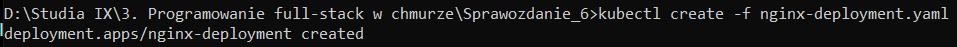
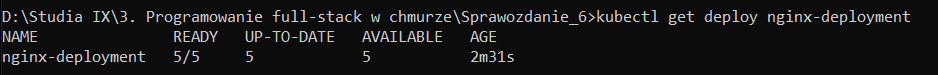
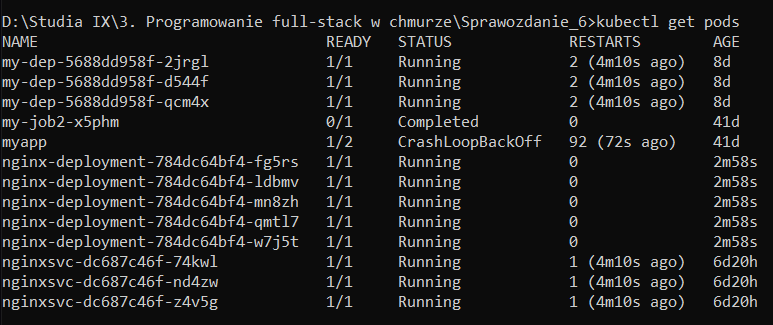
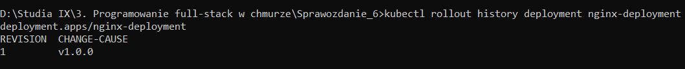
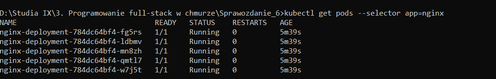
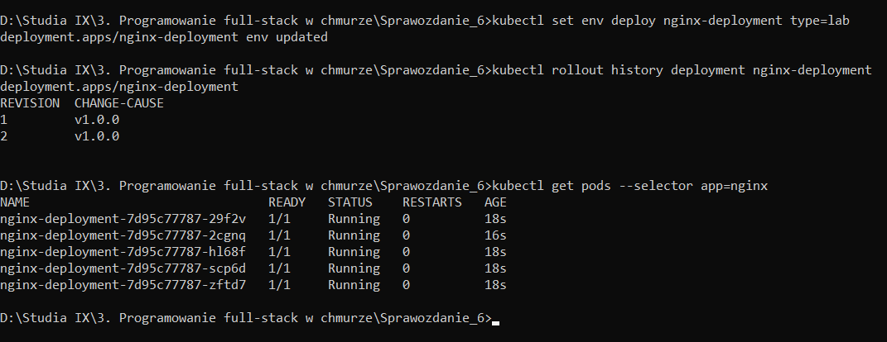

## Lab 6 - Zadanie

## Aktualizacja parametrów wdrożenia aplikacji. Strategie aktualizacji.. Historia aktualizacji i przywracanie poprzednich wersji aplikacji

## Łukasz Chudy 92844

### Polecenie

Proszę utworzyć plik YAML, który będzie manifestem dla Deployment wykorzystującego
obraz serwera Nginx. Należy zdefiniować wykorzystanie obrazu w wersji 1.9 oraz
uruchomienie 5 replik serwera. Dodatkowo wdrożenie powinno mieć etykietę typ=proxy


Następnie w tym pliku skonfigurować takie parametry strategi aktualizacji, aby w trakcie
realizacji tej aktualizacji nie było więcej niż 2 Pod-y niedostępne w tym samym czasie.


W opracowanym pliku YAML powinna również znaleźć się właściwa adnotacja, opisująca
tą wersję aplikacji.


### nging-deployment.yaml

```
apiVersion: apps/v1
kind: Deployment
metadata:
  name: nginx-deployment
  labels:
    app: nginx
    type: proxy
  annotations:
    kubernetes.io/change-cause: "v1.0.0"
    version: "1.0.0"
spec:
  replicas: 5
  selector:
    matchLabels:
      app: nginx
  template:
    metadata:
      labels:
        app: nginx
    spec:
      containers:
      - name: nginx
        image: nginx:1.9
        ports:
        - containerPort: 80
  strategy:
    type: RollingUpdate
    rollingUpdate:
      maxUnavailable: 2
```

### Utworzenie deployment'u

```kubectl create -f nginx-deployment.yaml```



### Sprawdzenie

Pokaż szczegółowe informacje na temat deployment'u **nginx-deployment**.

```kubectl get deploy nginx-deployment```



Wyświetl wszystkie działające pody w klastrze:

```kubectl get pods```



Wyświetl historię wersji aktualizacji dla deploymentu **nginx-deployment**. 

```kubectl rollout history deployment nginx-deployment```



Wyświetl informacje o podach z etykietą **app=nginx**.

```kubectl get pods --selector app=nginx```



Wymuszenie update poprzez zmiany parametrów oraz sprawdzenie efektów:

```kubectl set env deploy nginx-deployment type=lab```

```kubectl rollout history deployment nginx-deployment```

```kubectl get pods --selector app=nginx```


