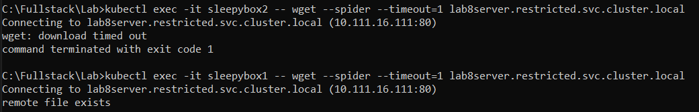

## Lab 8 - Zadanie

## Obiekty NetworkPolicy. Deklarowanie reguł sieciowych. Kontrolery Ingress

## Łukasz Chudy 92844

### Polecenie

1. Należy uruchomić serwer WWW o nazwie lab8server w przestrzeni nazw restricted,
używając obraz nginx oraz utworzyć dla niego Service typu ClusterIP.
2. W domyślnej przestrzeni nazw należy uruchomić dwa Pod-y: Sleepybox1 i Sleepybox2,
każdy oparty na obrazie busybox i wykonujący przy polecenie: sleep 3600
3. Należy utworzyć NetworkPolicy, który ogranicza ruch przychodzący do przestrzeni nazw
restricted w taki sposób, że dostęp do lab8server ma tylko pod Sleepybox1 z domyślnej
przestrzeni nazw a każdy inny dostęp do przestrzeni restricted jest zabroniony

```minikube delete```

```minikube start --cni=calico --container-runtime=docker --memory=2048```

### server-deployment.yaml

```
apiVersion: apps/v1
kind: Deployment
metadata:
  name: lab8server
  namespace: restricted
spec:
  replicas: 1
  selector:
    matchLabels:
      app: lab8server
  template:
    metadata:
      labels:
        app: lab8server
    spec:
      containers:
        - name: lab8server
          image: nginx
```

### server-service.yaml

```
apiVersion: v1
kind: Service
metadata:
  name: lab8server
  namespace: restricted
spec:
  selector:
    app: lab8server
  ports:
    - protocol: TCP
      port: 80
      targetPort: 80
  type: ClusterIP
```

### sleepybox-pod.yaml

```
apiVersion: v1
kind: Pod
metadata:
  name: sleepybox1
  labels:
    allowToLab8server: "true"
spec:
  containers:
    - name: busybox-container
      image: busybox
      command: ["/bin/sh", "-c", "sleep 3600"]
```

### sleepybox2-pod.yaml

```
apiVersion: v1
kind: Pod
metadata:
  name: sleepybox2
  labels:
    allowToLab8server: "false"
spec:
  containers:
    - name: busybox-container
      image: busybox
      command: ["/bin/sh", "-c", "sleep 3600"]
```

### network-policy.yaml

```
apiVersion: networking.k8s.io/v1
kind: NetworkPolicy
metadata:
  name: allow-from-sleepybox1
  namespace: restricted
spec:
  podSelector:
    matchLabels:
      app: lab8server
  ingress:
    - from:
        - namespaceSelector:
            matchLabels:
              kubernetes.io/metadata.name: default
          podSelector:
            matchLabels:
              allowToLab8server: "true"
```

### Utworzenie deploymentu, serwisu, podów i polityki

```kubectl create namespace restricted```

```kubectl apply -f server-deployment.yaml```

```kubectl apply -f server-service.yaml```

```kubectl apply -f sleepybox-pod.yaml```

```kubectl apply -f sleepybox2-pod.yaml```

```kubectl apply -f network-policy.yaml```

### Sprawdzenie

```kubectl exec -it sleepybox2 -- wget --spider --timeout=1 lab8server.restricted.svc.cluster.local```

